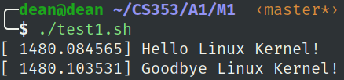
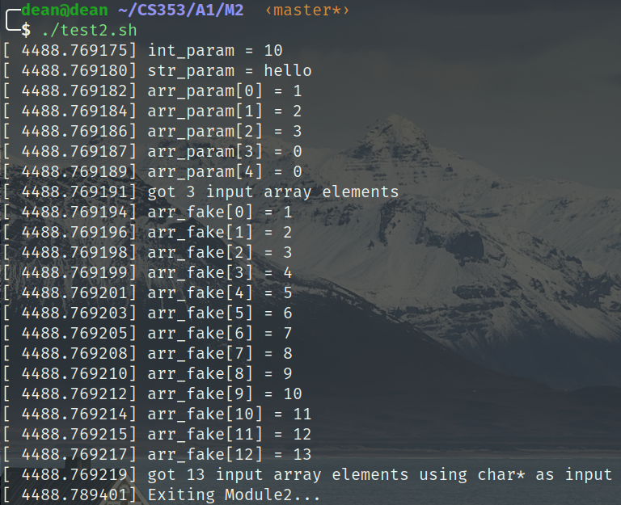
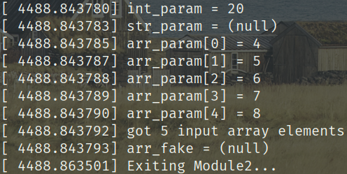
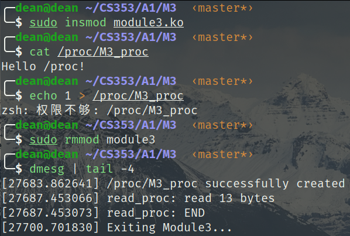
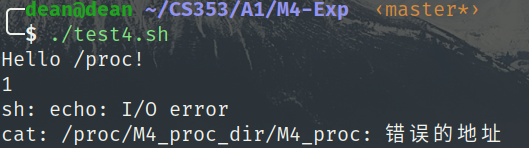
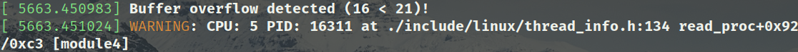
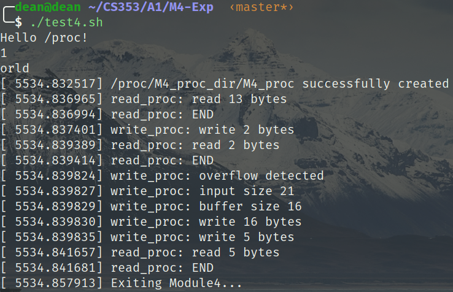
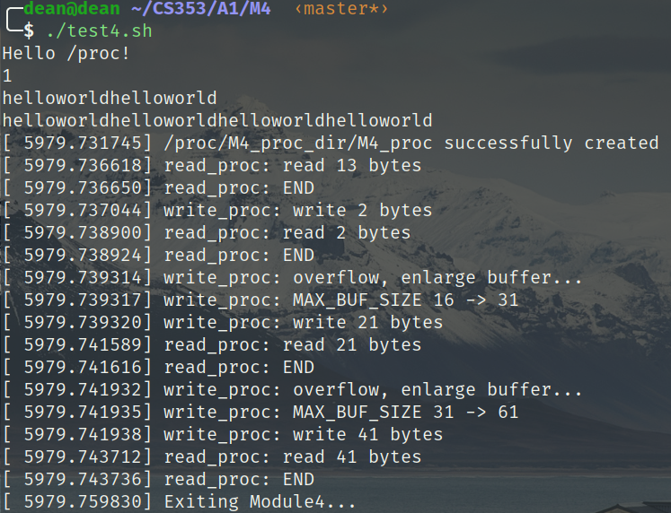

# CS353 Linux内核 Project1 报告

517030910214 刘宏洲

## 0. 简介

本Project的主要内容是熟悉Linux内核的模块编程以及proc文件系统。按照要求，完成以下四个模块：

1. 模块一，加载和卸载模块时在系统日志输出信息
2. 模块二，支持整型、字符串、数组参数，加载时读入并打印
3. 模块三，在/proc下创建只读文件
4. 模块四，在/proc下创建文件夹，并创建一个可读可写的文件

本次Project的环境配置如下：

- Ubuntu 18.04 LTS with Linux 5.5.8
- GNU Make 4.1
- gcc 7.5.0

## 1. 模块一

### 1.1 实现

在本模块中，主要熟悉模块初始化函数、退出函数的编写及注册。主要使用了在`linux/module.h`中定义的`module_init()`以及`module_exit()`两个宏来注册这两个函数。代码如下：

```C
#include <linux/kernel.h>
#include <linux/module.h>
#include <linux/init.h>

static int __init M1_init(void)
{
    printk(KERN_INFO "Hello Linux Kernel!\n");
    return 0;
}

static void __exit M1_exit(void)
{
    printk(KERN_INFO "Goodbye Linux Kernel!\n");
}
MODULE_LICENSE("GPL");
MODULE_DESCRIPTION("Module2");
MODULE_AUTHOR("Hongzhou Liu");
module_init(M1_init);
module_exit(M1_exit);
```

### 1.2 结果

编译模块后使用`insmod`插入`module1.ko`，利用`dmesg`查看系统日志（以上命令均写入脚本`test1.sh`）即可看到实验结果：

<center>
    
    <br>
    <div style="color:orange; border-bottom: 1px solid #d9d9d9;
    display: inline-block;
    color: #999;
    padding: 2px;">图1. 模块一 结果</div>
</center>

## 2. 模块二

### 2.1 实现

本模块需要实现模块初始化时传入参数的功能。必须使用`linux/moduleparam.h`中定义的宏`module_param()`注册参数，也可使用`module_param_array()`注册数组参数。而`module_param_array()`注册的是定长数组，如果输入数组元素超出限制，则会导致输入错误。还可以使用`char*`类型的参数实现“伪”不定长数组。以下是参数的注册代码：

```C
static int int_param;
static char* str_param;
static char* arr_param_fake;
static int arr_num_fake = 0;
static int* arr_fake;
static int arr_param[5];
static int arr_argc = 0;
module_param(int_param, int, 0644);
module_param(str_param, charp, 0644);
module_param_array(arr_param, int, &arr_argc, 0644);
module_param(arr_param_fake, charp, 0644);
```

其中`arr_param_fake`、`arr_num_fake`以及`arr_fake`分别是“不定长数组”的字面值、长度以及指向真实数据的指针，后两者将在初始化函数中计算得到。需要注意的是，如果参数是字符串，注册时宏的类型参数应该传入`charp`，而`module_param_array`还需要传入一个指针`arr_argc`表示实际得到的数组元素个数。传入参数后即可在初始化函数`M2_init()`中打印，而“不定长数组”则需要转换为int类型的数组，这个转换的实现如下：

```C
static int __init M2_init(void)
{
    int i = 0, tmp = 0;
    char* cp = arr_param_fake;
    ......
    if(arr_param_fake)
    {
        arr_fake = (int*)kmalloc_array(strlen(arr_param_fake), sizeof(int), GFP_KERNEL);
        while(*cp)
        {
            while(*cp >= '0' && *cp <= '9')
            {
                tmp *= 10;
                tmp += *cp - '0';
                cp++;
            }
            arr_fake[arr_num_fake++] = tmp;
            tmp = 0;
            cp++;
        }
        ......
        kfree(arr_fake);    
    }
    else
    {
        printk(KERN_INFO "arr_fake = (null)\n");
    }
    return 0;
}
```

首先要确定是否传入了“不定长数组”，若忽略此判断，不传入这个参数，就会解引空指针造成内核panic。如果传入了参数，需要为数组申请一块内核空间。`kmalloc`是定义在`linux/slab.h`中的函数，用于申请内核空间。保险起见，我们申请一块足够容纳所有元素的空间，然后将字符串中的每个代表数字的子串转换为int类型的数据放入数组即可。打印过程省略，打印过后使用`kfree`释放这一空间即可。

其他的打印语句、模块退出时的函数以及初始化、退出函数的注册便不再赘述。

### 2.2 结果

测试模块二的命令如下（摘取自test2.sh）：

```bash
sudo -S insmod module2.ko int_param=10 str_param=hello arr_param=1,2,3 arr_param_fake=1,2,3,4,5,6,7,8,9,10,11,12,13
sudo -S rmmod module2

sudo -S insmod module2.ko int_param=20 arr_param=4,5,6,7,8
sudo -S rmmod module2
```

使用`dmesg`打印系统日志可以看见结果：

<center>
    
    <br>
    <div style="color:orange; border-bottom: 1px solid #d9d9d9;
    display: inline-block;
    color: #999;
    padding: 2px;">图2. 模块二 结果1</div>
</center>

<center>
    
    <br>
    <div style="color:orange; border-bottom: 1px solid #d9d9d9;
    display: inline-block;
    color: #999;
    padding: 2px;">图3. 模块二 结果2</div>
</center>

可见，对于字符串参数，若不传入参数，则自动显示`(null)`，而数组参数没有元素的位置自动初始化为0。而“不定长数组”参数通过传入字符串再转换的方式，也实现了相应的功能。

## 3. 模块三

### 3.1 实现

在本模块中，需要在/proc文件夹下创建一个只读文件。调用在`linux/proc_fs.h`头文件中定义的`proc_create()`函数可以返回一个指向`proc_dir_entry`结构体的指针，如果指针非空，表明在指定路径创建了一个文件。具体的创建方式如下：

```C
struct proc_dir_entry *entry = NULL;
static int __init M3_init (void) 
{
    entry = proc_create("M3_proc", 0444, NULL, &proc_fops);
    if(!entry)
    {
        printk(KERN_ERR "Unable to create /proc/M3_proc\n");
        return -EINVAL;
    }
    printk(KERN_INFO "/proc/M3_proc successfully created\n");
    msg = "Hello /proc!\n";
    strcpy(proc_buf, msg);
    proc_buf_size = strlen(msg);
    return 0;
}
```

`proc_create()`的第一个参数是文件名，第二个参数为访问权限，`0444`代表无论根用户、拥有者和其用户组都只有读的权限，第三个参数代表父文件夹对应的`proc_dir_entry`指针，而这里父文件夹为/proc，则为NULL。最后一个参数是指向`file_operations`结构体的指针，在这个结构体中定义操作文件是需要调用的函数。这里我们需要注册读文件和写文件时调用的函数：

```c
struct file_operations proc_fops = { .read = read_proc, .write = write_proc };
```
而读文件时，我们像将内核中的信息显示给用户看。在模块初始化时，我们已经将`proc_buf`填入了信息，并计算了对应的`proc_buf_size`。我们只需利用`linux/uaccess.h`中定义的`copy_to_user()`函数，将数据拷贝至用户空间的缓存`usr_buf`即可。值得注意的是，若`read_proc()`的返回值不为0，那么它将被一直调用。但如果第一次调用即返回0，那么用户也不会看到输出。因此，我们需要控制此函数恰好被调用2次，第一次返回拷贝至用户空间的数据大小，第二次返回0。利用`static`变量的特性，引入`finished`变量即可实现这个功能。


```c
static ssize_t read_proc(struct file *filp, char *usr_buf, size_t count, loff_t *offp) 
{
    static int finished = 0;
    if(finished)
    {
        printk(KERN_INFO "read_proc: END\n");
        finished = 0;
        return 0;
    }
    finished = 1;
    if(copy_to_user(usr_buf, proc_buf, proc_buf_size))
    {
        printk(KERN_ERR "Copy to user unfinished\n");
        return -EFAULT;
    }
    printk(KERN_INFO "read_proc: read %lu bytes\n", proc_buf_size);
    return proc_buf_size;
}
```

具体的`write_proc()`函数在下节详细介绍，这里只是为了体现创建的文件的只读性质。最后我们还需要在`M3_exit()`函数中调用`proc_remove(entry)`删除文件。

### 3.2 结果

编译模块后执行下列命令，可以看到`M3_proc`是一个只读文件，普通用户不可写入（即使定义了写入时调用的函数）

<center>
    
    <br>
    <div style="color:orange; border-bottom: 1px solid #d9d9d9;
    display: inline-block;
    color: #999;
    padding: 2px;">图4. 模块三 结果</div>
</center>
实验过程中还发现一个现象，若执行以下指令：

```bash
sudo echo 1 > /proc/M3_proc
```

无论文件的读写权限是0444还是0644，均提示权限不足。而0644权限下，超级用户应该可以写入。查询资料发现`sudo`指令只对离它最近的命令起作用，而管道`>`也算作命令，因此使用`sudo`命令作为超级用户写入应该执行：

```bash
sudo sh -c "echo 1 > /proc/M3_proc"
```

这时候，处于0444权限下的文件居然也可以被写入了。根据网上的资料，即使root权限为0，超级用户下，也可以对文件进行读写。

## 4. 模块四

### 4.1 实现

在本模块中需要在/proc文件夹下建立一个文件夹，然后在文件夹中创建一个可读可写的文件。

首先，我们需要利用`proc_mkdir()`函数创建文件夹，再利用`proc_create()`函数创建文件。在`M4_init()`函数中：

```c
	base = proc_mkdir("M4_proc_dir", NULL);
    if(!base)
    {
        printk(KERN_ERR "Unable to create /proc/M4_proc_dir/\n");
        return -EINVAL;
    }
    entry = proc_create("M4_proc", 0666, base, &proc_fops);
    if(!entry)
    {
        printk(KERN_ERR "Unable to create /proc/M4_proc_dir/M4_proc\n");
        proc_remove(base);
        return -EINVAL;
    }
```

`proc_mkdir()`函数只需指定文件夹名称以及父文件夹的`proc_dir_entry`结构体指针即可。`proc_create()`函数此时需要把父文件夹指针设置为`base`，并指定权限为0666。

<center>
    
    <br>
    <div style="color:orange; border-bottom: 1px solid #d9d9d9;
    display: inline-block;
    color: #999;
    padding: 2px;">图5. 模块四 缓冲区溢出1</div>
</center>

<center>
    
    <br>
    <div style="color:orange; border-bottom: 1px solid #d9d9d9;
    display: inline-block;
    color: #999;
    padding: 2px;">图6. 模块四 缓冲区溢出2</div>
</center>

<center>
    
    <br>
    <div style="color:orange; border-bottom: 1px solid #d9d9d9;
    display: inline-block;
    color: #999;
    padding: 2px;">图7. 模块四 写覆盖</div>
</center>
### 4.2 结果

解决了缓冲区溢出问题和写覆盖问题后，我们向文件写入超出缓冲区原大小的数据时，也能获得正确的结果。观察系统日志就可以看出，缓冲区的最大长度也是在不断变化的。

<center>
    
    <br>
    <div style="color:orange; border-bottom: 1px solid #d9d9d9;
    display: inline-block;
    color: #999;
    padding: 2px;">图8. 模块四 结果</div>
</center>

## 5. 总结与感想