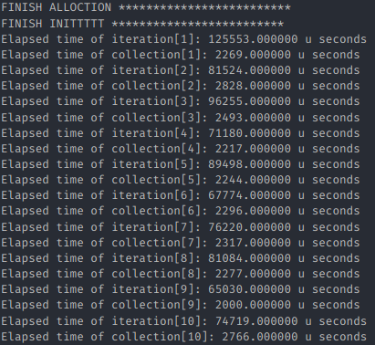
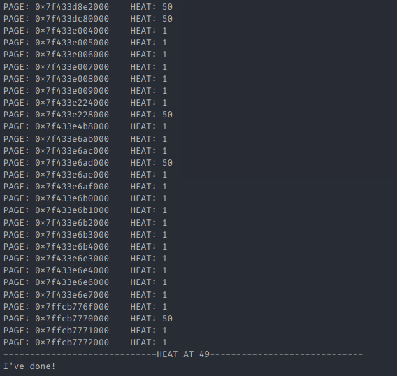

# CS353 Linux内核 大作业报告

517030910214 刘宏洲

## 0. 简介

在本作业中，我们实现了进程页面热度的收集与展示。主要实现了一个模块，用于过滤指定进程的数据页面、采集热度信息，并且实现了热度信息在内核态与用户态之间的共享。

本大作业的系统环境配置如下：

- Ubuntu 18.04.4 LTS (GNU/Linux 5.5.8 x86_64)
- GNU Make 4.1
- gcc 7.5.0

## 1. 过滤页面

### 1.1 实现

首先，我们需要过滤掉与进程内数据无关的页面。由于我们首先获取的是进程的VMA结构体，我们可以根据VMA的特征来判断一个VMA所包含的所有页面是否为包含数据的页面。在`linux/mm_types.h`中定义的`mm_struct`结构体中的一些数据成员引起了我的注意：

```c
unsigned long total_vm;	   /* Total pages mapped */
unsigned long locked_vm;   /* Pages that have PG_mlocked set */
atomic64_t    pinned_vm;   /* Refcount permanently increased */
unsigned long data_vm;	   /* VM_WRITE & ~VM_SHARED & ~VM_STACK */
unsigned long exec_vm;	   /* VM_EXEC & ~VM_WRITE & ~VM_STACK */
unsigned long stack_vm;	   /* VM_STACK */
```

根据注释和变量名，我们知道，这些数据成员统计了一个内存描述符所管理的各种类型的VMA数量。而`data_vm`正是包含数据的VMA的数量，其注释告诉我们，可以利用这个特征过滤出包含数据的所有VMA。因此，过滤页面的代码如下：

```c
static int filter_page(pid_t pid)
{
    struct pid *p;
    struct task_struct *tsk;
    struct vm_area_struct *cur;
    unsigned long filtered_num, addr;

    if (pid < 0)
    {
        printk(KERN_ERR "Invalid PID\n");
        return -EFAULT;
    }

    p = find_get_pid(pid);

    if (!p)
    {
        printk(KERN_ERR "Invalid pid\n");
        return -EFAULT;
    }

    tsk = get_pid_task(p, PIDTYPE_PID);

    if (!tsk)
    {
        printk(KERN_ERR "Invalid task_struct\n");
        return -EFAULT;
    }

    if (!tsk->mm)
    {
        printk(KERN_ERR "task_struct->mm is NULL\n");
        return -EFAULT;
    }

    cur = tsk->mm->mmap;
    filtered_num = 0;
    heat_info_len = 0;

    while (cur)
    {
        if (cur->vm_flags & (VM_WRITE & ~VM_SHARED & ~VM_STACK))
        {
            printk(KERN_INFO "FILTERED: 0x%lx\t0x%lx\n", cur->vm_start, cur->vm_end);
            for (addr = cur->vm_start; addr < cur->vm_end; addr += PAGE_SIZE)
            {
                heat_info[heat_info_len + 1].addr = addr;
                heat_info[heat_info_len + 1].access_time = 0;
                heat_info_len++;
            }
            filtered_num += vma_pages(cur);
        }
        cur = cur->vm_next;
    }
    heat_info[0].addr = 0;
    heat_info[0].access_time = filtered_num;
    if (is_show_malloc)
        printk(KERN_INFO "total: %ld, filtered: %ld, malloc: %ld\n", tsk->mm->total_vm, filtered_num, malloc_num);
    else
        printk(KERN_INFO "total: %ld, filtered: %ld\n", tsk->mm->total_vm, filtered_num);
    
    return 0;
}
```

首先调用`find_get_pid`以及`get_pid_task`，从进程PID获得进程的`task_struct`，从而找到进程的`vm_area_struct`。随后，遍历`vm_area_struct`链表，根据条件过滤页面，并将页面的信息存入`heat_info`数组中，置访问次数为0。为了方便后续与用户态的信息传递，将过滤所得数据页面总数存入数组的第一个元素中。在这里，我们假定一个进程的VMA链表在短时间内是不发生改变的。这方便了后续热度信息的收集。

### 1.2 结果

我们对提供的`heat.cpp`与`heat_rand.cpp`进行一定的修改，并利用这两个程序来展示这个部分的实验结果。

使用以下命令，便可观察输出（只展示heat.cpp的结果）

```bash
./heat 10
dmesg
```

<center>
    
    <div style="color:orange; border-bottom: 1px solid #d9d9d9;
    display: inline-block;
    color: #999;
    padding: 2px;">图1. 筛选页面</div>
</center>

由于终端显示的行数有限，我截取了`/var/log/kern.log`中的内容，可见，筛选出的页面总数为申请页面总数的109%，说明这样的筛选策略是有效的。

<center>
    
    <div style="color:orange; border-bottom: 1px solid #d9d9d9;
    display: inline-block;
    color: #999;
    padding: 2px;">图2. 申请页面</div>
</center>

除此之外，我们观察用户态申请的二维数组中，部分一维数组的起始地址与结束地址，如图2。我们会发现，这些地址都包含在筛选出的VMA中，并且，每一个一维数组的起始地址与页面起始地址都不相同。例如图中的第一个数组的起始地址为0x560ab65a3f80，而它所在的页面起始地址应当为0x560ab65a3000。

## 2. 收集页面热度

### 2.1 实现

得到了过滤后的页面，就可以开始统计热度信息了。统计热度信息的实现如下：

```c
static int collect_heat(pid_t pid) 
{
    struct pid *p;
    struct task_struct *tsk;
    pte_t *pte;
    int i;
    ktime_t calltime, delta, rettime;
    unsigned long long duration;

    if (pid < 0)
    {
        printk(KERN_ERR "Invalid PID\n");
        return -EFAULT;
    }

    p = find_get_pid(pid);

    if (!p)
    {
        printk(KERN_ERR "Invalid pid\n");
        return -EFAULT;
    }

    tsk = get_pid_task(p, PIDTYPE_PID);

    if (!tsk)
    {
        printk(KERN_ERR "Invalid task_struct\n");
        return -EFAULT;
    }

    if (!tsk->mm)
    {
        printk(KERN_ERR "task_struct->mm is NULL\n");
        return -EFAULT;
    }

    calltime = ktime_get();
    for (i = 0; i < heat_info_len; ++i)
    {
        pte = _find_pte(tsk->mm, heat_info[i + 1].addr);
        if (!pte)
        {
            continue;
        }
        if (pte_young(*pte))
        {
            heat_info[i + 1].access_time += 1;
            *pte = pte_mkold(*pte);
        }
    }
    rettime = ktime_get();
    delta = ktime_sub(rettime, calltime);
    duration = (unsigned long long)ktime_to_us(delta);
    printk(KERN_INFO "Heat collection elapsed after %lld us\n", duration);
    return 0;
}
```

可见，同第一部分一样，要调用`find_get_pid`以及`get_pid_task`获得`task_struct`。随后遍历之前过滤得到的所有数据页面，并将页面的虚拟地址转化为对应的页表项`pte`。随后调用`pte_young`判断在上一个时间段中，这个页面是否被访问。若被访问过，则需要统计累计访问信息，并调用`pte_mkold`清空所有标志位。值得注意的是，`pte_mkold`并不会改变原有表项的值，而是返回一个新的`pte`，因此，我们需要将返回值写入这个`pte`中，完成更新。注意，有的页面虚拟地址对应的`pte`并不存在（没有数据存在），因此我们需要判断并跳过这些虚拟地址。转换虚拟地址到`pte`的函数如下：

```c
static inline pte_t* _find_pte(struct mm_struct *mm, unsigned long addr)
{
    pgd_t *pgd = NULL;
    p4d_t *p4d = NULL;
    pud_t *pud = NULL;
    pmd_t *pmd = NULL;
    pte_t *pte = NULL;

    pgd = pgd_offset(mm, addr);
    if(pgd_none(*pgd) || pgd_bad(*pgd))
        return NULL;

    p4d = p4d_offset(pgd, addr);
    if(p4d_none(*p4d) || p4d_bad(*p4d))
        return NULL;

    pud = pud_offset(p4d, addr);
    if(pud_none(*pud) || pud_bad(*pud))
        return NULL;

    pmd = pmd_offset(pud, addr);
    if(pmd_none(*pmd) || pmd_bad(*pmd))
        return NULL;

    pte = pte_offset_map(pmd, addr);
    if(pte_none(*pte) || !pte_present(*pte))
        return NULL;
    return pte;
}
```

### 2.2 结果

为了更好地测算收集热度所耗费的时间，我们将收集和信息打印分为两个函数实现，通过用户态写入`/proc/heat`文件的信息调用这两个函数。打印信息的函数实现非常简单

```c
static void print_info(void)
{
    int i;
    for (i = 0; i < heat_info_len; ++i)
    {
        printk(KERN_INFO "PAGE: 0x%lx\theat: %d\n", heat_info[i + 1].addr, heat_info[i + 1].access_time);
    }
}
```

再此基础上，再次运行`heat.cpp`与`heat_rand.cpp`（输入参数与第一部分一致），我们可以在内核日志中看到获得的热度信息结果。由于一次打印将会输出约17万行，我们只在用户态程序的最后一个循环结束后打印热度信息。在`/var/log/kern.log`中的输出以及用户态的输出如下：

<center>
    
     
    <br>
    <div style="color:orange; border-bottom: 1px solid #d9d9d9;
    display: inline-block;
    color: #999;
    padding: 2px;">图3. 收集热度（部分输出）</div>
</center>
可见，收集约170000个页面热度信息所需的时间约为3ms，相对于访问密集型程序的计算时间来说还是比较小的。最终，经历了100个循环后的部分热度信息输出如下：

<center>
    
    <div style="color:orange; border-bottom: 1px solid #d9d9d9;
    display: inline-block;
    color: #999;
    padding: 2px;">图4. 热度信息</div>
</center>

## 3. 与用户态交互

### 3.1 实现

与用户态程序的交互分为两部分，一部分是用户态将命令写入`/proc/heat`文件，触发相应功能，另一部分是用户态读取共享在`/proc/heat`中的热度信息并输出。

proc文件系统中文件定义的各种操作不再叙述。写函数的定义也很简单，并且已经在之前两个部分实现了：

```c
static ssize_t getHeat_proc_write(struct file *file, const char __user *buffer, size_t count, loff_t *data)
{
    int pid;
    int ret;
    if (copy_from_user(proc_buf, buffer, count))
    {
        printk(KERN_ERR "Copy from user unfinished\n");
        return -EFAULT;
    }
    proc_buf[count] = '\0';

    if (strncmp(proc_buf, "filter", 6) == 0)
    {
        sscanf(proc_buf + 7, "%d", &pid);
        printk(KERN_INFO "filter PID: %d\n", pid);
        ret = filter_page(pid);
    }
    else if (strncmp(proc_buf, "collect", 7) == 0)
    {
        sscanf(proc_buf + 8, "%d", &pid);
        printk(KERN_INFO "collect PID: %d\n", pid);
        ret = collect_heat(pid);
    }
    else if (strncmp(proc_buf, "malloc", 6) == 0)
    {
        sscanf(proc_buf + 7, "%d %ld", &is_show_malloc, &malloc_num);
    }
    else if (strncmp(proc_buf, "print", 5) == 0)
    {
        print_info();
    }
    else
    {
        printk(KERN_ERR "Invalid input!\n");
    }
    
    return count;
}
```

这里的命令分为以下四种

1. `filter PID`：过滤给定PID对应进程的数据页面
2. `collect PID`：在过滤的基础上，收集给定PID对应进程的页面热度信息
3. `malloc 0/1 size`：是否（0/1）打印用户态程序所分配的页面数
4. `print`：内核态打印热度信息

由于需要在用户态的程序中输出热度信息，我们需要通过proc文件系统共享`heat_info`数组，并通过自定义读函数来实现用户态的热度信息输出。这部分内核态的实现也很简单

```c
static ssize_t getHeat_proc_read(struct file *filp, char *usr_buf, size_t count, loff_t *offp) 
{
    if (copy_to_user(usr_buf, heat_info, sizeof(heat_info)))
    {
        printk(KERN_ERR "Copy to user unfinished\n");
        return -EFAULT;
    }
    return sizeof(heat_info);
}
```

可以直接将`heat_info`复制到用户空间的缓冲区去，然后在用户态程序中声明同样的结构体以及数组，使用读文件函数即可获得这些信息。

我们将`heat.cpp`以及`heat_rand.cpp`进行修改。首先，将获取、打印热度信息与原有计算函数`heat()`分为两个线程。即

```c
int main(int argc, char *argv[]){
	pthread_t id;
	int ret;
	......
	ret = pthread_create(&id, NULL, &collect, NULL);
	if (ret == 0)
	{
		printf("-----------------------------Start heat collection-----------------------------\n");
	}
	else
	{
		printf("Start collection failed!\n");
		return 0;
	}

	heat();
    
    return 0;
}
```

在`heat()`函数中，使之每计算5个循环休眠一定时间。`collect`线程的实现如下：

```c
void* collect(void* args)
{
	int f, i, c, actual_len;
	char write_info[100];
	// char read_info[5000000];

	sleep(1);

	f = open("/proc/heat", O_RDWR | O_TRUNC);

	ftruncate(f, 0);
    lseek(f, 0, SEEK_SET);
	sprintf(write_info, "malloc 0 0");
	write(f, write_info, strlen(write_info));

	ftruncate(f, 0);
    lseek(f, 0, SEEK_SET);
	sprintf(write_info, "filter %d", getpid());
	write(f, write_info, strlen(write_info));

	for (c = 0; c < 50; ++c)
	{
		ftruncate(f, 0);
		lseek(f, 0, SEEK_SET);
		sprintf(write_info, "collect %d", getpid());
		write(f, write_info, strlen(write_info));
		read(f, read_info, sizeof(read_info));
		actual_len = read_info[0].access_time;
		printf("-----------------------------HEAT AT %d-----------------------------\n", c);
		for (i = 1; i <= actual_len; ++i)
		{
			if(read_info[i].access_time > 0)
				printf("PAGE: 0x%lx\tHEAT: %d\n", read_info[i].addr, read_info[i].access_time);
		}
		printf("-----------------------------HEAT AT %d-----------------------------\n", c);
		usleep(50000);
	}
	close(f);
}
```

首先需要等待`heat()`函数初始化完毕，然后打开`/proc/heat`文件，并进行页面过滤。随后执行50次热度收集与打印。每一次打印完毕后，需要睡眠一定时间，让`heat()`进行一定的计算。而这个睡眠时间是人为设定的，必须要恰当地设置，使得`heat()`函数返回后`collect()`函数才返回。这样就完成了内核态和用户态之间热度信息的传递。

### 3.2 结果

直接运行benchmark中的两个程序（输入参数为10）即可观察热度信息的打印。由于收集一次热度信息输出的字符太多（约300万个），如果在终端使用`printf`输出，会花费大量时间，需要调整`heat`线程的睡眠时间，于是我将输出重定向至`res`文件中，以下是输出的结果：

<center>
    
     
    <br>
    <div style="color:orange; border-bottom: 1px solid #d9d9d9;
    display: inline-block;
    color: #999;
    padding: 2px;">图5. 用户态输出（部分）</div>
</center>

除此之外，我还绘制了热度信息的大致分布。

<center>
    
    <div style="color:orange; border-bottom: 1px solid #d9d9d9;
    display: inline-block;
    color: #999;
    padding: 2px;">图6. heat.cpp 热度分布</div>
</center>

<center>
    
    <div style="color:orange; border-bottom: 1px solid #d9d9d9;
    display: inline-block;
    color: #999;
    padding: 2px;">图7. heat_rand.cpp 热度分布</div>
</center>

由此可见，heat.cpp对于数据的访问频次比较均匀，而heat_rand.cpp对数据的访问主要集中在某几个地址。至于高地址部分，两个程序都出现了密集的波峰，这可能是因为数据页面在这一部分的分布比较分散。

## 4. 总结

在本大作业中，我实现了进程数据页面的过滤、热度信息的收集以及与用户态程序的交互。这次的大作业加深了我对于Linux内核内存管理相关知识的理解，并且进一步提升了我的Linux内核编程能力，我受益匪浅。