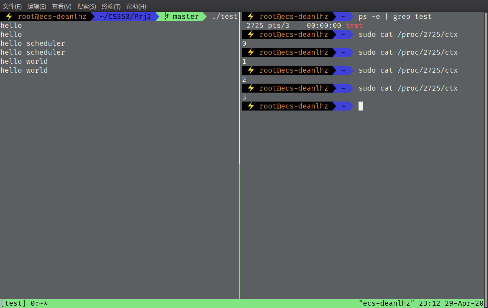
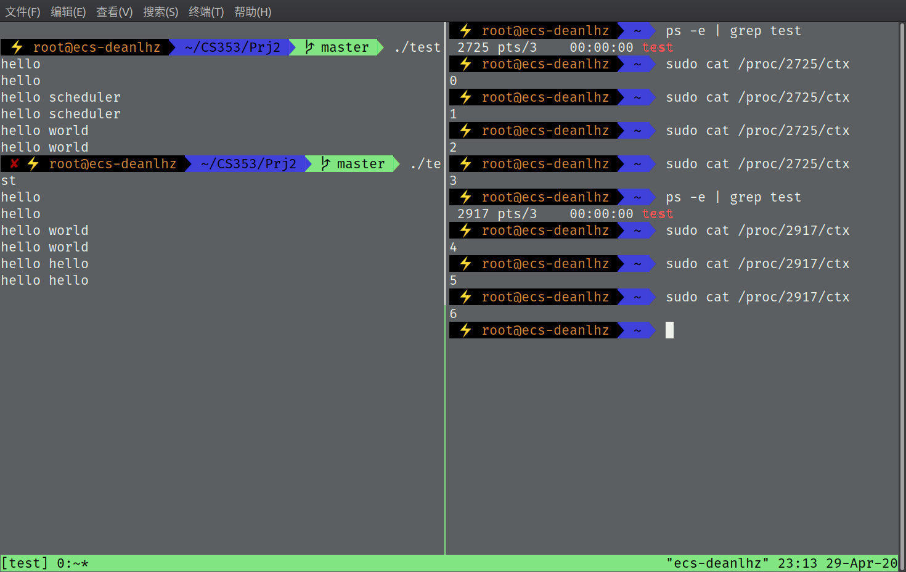
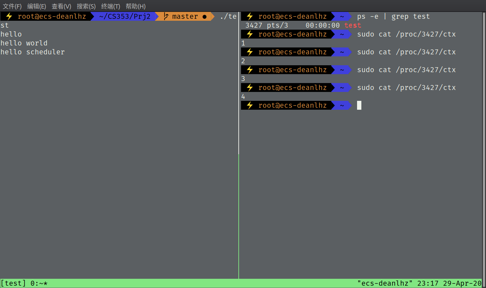

# CS353 Linux内核 Project2 报告

517030910214 刘宏洲

## 0. 简介

在本Project中，我们将研究Linux内核调度有关的代码，并修改内核代码，对进程的调度次数进行计数，并利用proc文件系统进行输出。

本次Project的实验平台为华为云ECS服务器，采用双核鲲鹏处理器），环境配置如下：

- Ubuntu 18.04.3 LTS (GNU/Linux 5.6.6 aarch64)
- GNU Make 4.1
- gcc 7.4.0

## 1. 实现

## 2. 结果

    
     
    
图1. 结果1

    
     
    
图2. 结果2

    
     
    
图3. 结果3

## 3. 总结与感想