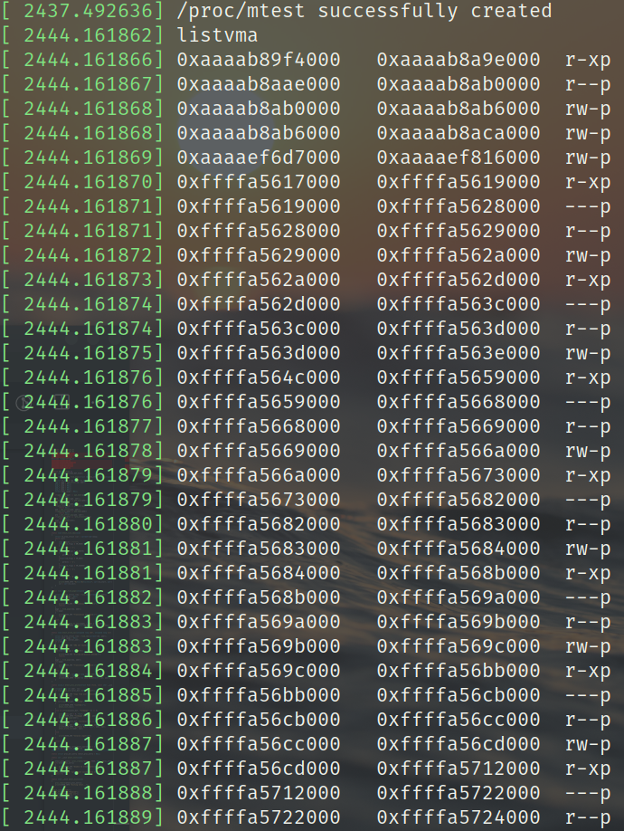
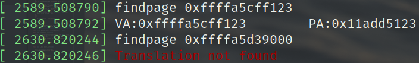

# CS353 Linux内核 Project3 报告

517030910214 刘宏洲

## 0. 简介

在本Project中，我们将探索有关Linux内存管理方面的内容。

本次Project的实验平台为华为云ECS服务器，它采用双核鲲鹏处理器，系统环境配置如下：

- Ubuntu 18.04.3 LTS (GNU/Linux 5.6.6 aarch64)
- GNU Make 4.1
- gcc 7.4.0

## 1. listvma

### 1.1 实现

这一部分需要实现打印当前进程的所有虚拟内存地址的功能。创建proc文件和初始化模块的部分已经很熟悉了。我们还需要编写一个处理输入参数的函数。而本次Project中我们只对proc文件写，因此需要在创建`proc_entry`的时候传入一个自定义的`proc_ops`结构体（以前是`file_operations`），其`.proc_write`字段为我们的自定义写函数。在这个写函数中，我们处理参数并调用相应函数。具体代码便不再赘述。

现在我们实现`listvma`功能。首先需要知道当前进程的虚拟地址在哪里，是如何被组织起来的。我们知道，每个进程都有自己的进程描述符`task_struct`，而当前进程的`task_struct`指针可以从`current`变量中获得，这个变量被定义在`asm/current.h`中。而`task_struct`中的`mm`指向了当前进程的内存描述符。观察`linux/mm_types.h`中定义的`mm_struct`，我们发现，其中定义了名为`mmap`的`vm_area_struct`结构体指针，其注释显示，这个指针指向虚拟内存区域构成的链表。

同样，在`linux/mm_types.h`中，我们可以找到`vm_area_struct`结构体的定义。

```c
struct vm_area_struct {
	/* The first cache line has the info for VMA tree walking. */

	unsigned long vm_start;		/* Our start address within vm_mm. */
	unsigned long vm_end;		/* The first byte after our end address
					   within vm_mm. */

	/* linked list of VM areas per task, sorted by address */
	struct vm_area_struct *vm_next, *vm_prev;
    ......
	struct mm_struct *vm_mm;	/* The address space we belong to. */
	pgprot_t vm_page_prot;		/* Access permissions of this VMA. */
	unsigned long vm_flags;		/* Flags, see mm.h. */
    ......
} __randomize_layout;
```

可以看到，一个进程的虚拟内存区间组成了一个双向链表，每个节点中保存了这段虚拟内存的起始地址与结束地址，这两个地址表示这个区间为[vm_start, vm_end)。而根据`mm.h`中的内容，`vm_flags`的低四位表示其读写权限，即0x1为可读，0x2为可写，0x4为可执行，0x8为可共享。至此，我们可以轻松完成这一部分的代码。

```c
static void mtest_list_vma(void) 
{
    struct vm_area_struct *cur = current->mm->mmap;
    while (cur)
    {
        char perm[5] = "----";
        if(cur->vm_flags & VM_READ)
        {
            perm[0] = 'r';
        }
        if(cur->vm_flags & VM_WRITE)
        {
            perm[1] = 'w';
        }
        if(cur->vm_flags & VM_EXEC)
        {
            perm[2] = 'x';
        }
        if(cur->vm_flags & VM_SHARED)
        {
            perm[3] = 's';
        }
        else
        {
            perm[3] = 'p';
        }

        printk(KERN_INFO "0x%lx\t0x%lx\t%s\n", cur->vm_start, cur->vm_end, perm);
        cur = cur->vm_next;
    }
}
```

可见，我们只需要遍历这个`vm_area_struct`结构体构成的链表，就可以获得所有的虚拟内存区间。

### 1.2 结果

我们直接在命令行中使用以下命令测试：

```bash
echo listvma > /proc/mtest
```

这样，使用`dmesg`就可以看到当前进程（这里是zsh）的所有虚拟内存区间。其结果如下：

<center>
    
    
    
    <br>
    <div style="color:orange; border-bottom: 1px solid #d9d9d9;
    display: inline-block;
    color: #999;
    padding: 2px;">图1. listvma结果</div>
</center>

这里可以发现，有大量的区间处于0xffff80000000以后，这一区域是64bit Linux的内核虚拟地址空间。进程在这里有大量虚拟地址区间存在。

## 2. findpage

### 2.1 实现

这一部分需要实现虚拟地址向物理地址的转换。我们知道，Linux的内存管理采用了分页机制。而这个机制也从一开始的采用二级页表到四级页表，现在的Linux已经可以支持五级页表了。虚拟地址需要通过页表的一层层转换，找到所在的页，从而找到处于物理内存中的页帧。

<center>
    
    <div style="color:orange; border-bottom: 1px solid #d9d9d9;
    display: inline-block;
    color: #999;
    padding: 2px;">图2. 四级页表</div>
</center>


上图是传统的四级页表，而五级页表则是在page global directory (pgd) 后面又增加了一级 page 4 directory (p4d)。而有关的结构体可以在`asm/pgtable_types.h` (x86)，`asm-generic?5level-fixup.h`等头文件中找到。

要将虚拟地址翻译为物理地址，只需要不断地取出虚拟地址内对应页表的内容作为偏移量索引页表，最终获得页帧。将最低的12位偏移量与页帧的基址相加，即可获得物理地址。相应代码如下：

```c
static struct page* _find_page(struct vm_area_struct *vma, unsigned long addr)
{
    struct mm_struct *mm = vma->vm_mm;
    pgd_t *pgd = pgd_offset(mm, addr);
    p4d_t *p4d = NULL;
    pud_t *pud = NULL;
    pmd_t *pmd = NULL;
    pte_t *pte = NULL;
    struct page *page = NULL;

    if(pgd_none(*pgd) || pgd_bad(*pgd))
        return NULL;
    p4d = p4d_offset(pgd, addr);
    if(p4d_none(*p4d) || p4d_bad(*p4d))
        return NULL;
    pud = pud_offset(p4d, addr);
    if(pud_none(*pud) || pud_bad(*pud))
        return NULL;
    pmd = pmd_offset(pud, addr);
    if(pmd_none(*pmd) || pmd_bad(*pmd))
        return NULL;
    pte = pte_offset_map(pmd, addr);
    if(pte_none(*pte) || !pte_present(*pte))
        return NULL;
    page = pte_page(*pte);
    if(!page)
        return NULL;
    pte_unmap(pte);
    return page;
}
```

这里大量用到了定义在`asm/pgtable.h`中的函数，后缀为offset的函数用于根据虚拟地址`addr`取出对于层级页表的表项。而后缀为none、bad、present等的函数，则被用于检测当前虚拟地址是否能被转换为物理地址（是否在各级页表中有表项）。值得注意的是，第一级页表索引时，需要提供当前虚拟地址区间的内存描述符。通过`vm_area_struct`结构体定义包含的`vm_mm`项可以找到内存描述符。最后，如果找到了虚拟地址所在页，这个函数将返回指向页描述符的指针。

```c
static void mtest_find_page(unsigned long addr)
{
    struct vm_area_struct *vma = find_vma(current->mm, addr);
    struct page *page = NULL;
    unsigned long phy_addr;
    if (!vma)
    {
        printk(KERN_ERR "Translation not found\n");
        return;
    }
    page = _find_page(vma, addr);
    if(!page)
    {
        printk(KERN_ERR "Translation not found\n");
        return;
    }
    else
    {
        phy_addr = page_to_phys(page) | (addr & ~PAGE_MASK);
        printk(KERN_INFO "VA:0x%lx\tPA:0x%lx\n", addr, phy_addr);
    }
}
```

在以上函数中，首先利用`find_vma`获得虚拟地址对应的vma结构体，也可以判断当前虚拟地址是否在这个进程的虚拟地址区间中。随后我们从`_find_page`获得页描述符，判断对于这个虚拟地址，是否存在翻译。如果一切正常，我们将页的基址用`page_to_phys`转换为页帧的基址，并将低12位设置为虚拟地址的低12位就可以获得物理地址。

### 2.2 结果

我们采用以下两条命令来测试

```bash
echo findpage 0xffffa5cff123 > /proc/mtest
echo findpage 0xffffa5d39000 > /proc/mtest
```

根据第一部分的结果，第一条命令中的虚拟地址是存在于进程的虚拟地址区间中的。而第二条命令中的虚拟地址不在任何区间中。因此可以看到如下结果：

<center>
    
    <div style="color:orange; border-bottom: 1px solid #d9d9d9;
    display: inline-block;
    color: #999;
    padding: 2px;">图3. findpage结果</div>
</center>

## 3. writeval

### 3.1 实现

在第二部分的基础上，我们可以很轻松地实现writeval这一功能。值得注意的是，在一个进程中要对指定地址写数据时，这个地址是进程的虚拟地址。然而模块的特殊之处在于，它运行在内核态，因此虚拟地址空间是共享的内核态虚拟地址空间。而在64位系统中，内核态的低端虚拟地址空间线性地映射了所有物理地址空间（与32位系统不同）。因此，为了在模块中修改一个运行于用户态的进程的虚拟地址的值，我们需要首先将这个地址转化为物理地址，然后再转换到内核的虚拟地址空间中。代码如下：

```c
static void mtest_write_val(unsigned long addr, unsigned long val)
{
    struct vm_area_struct *vma = find_vma(current->mm, addr);
    struct page *page = NULL;
    unsigned long *kernel_addr;
    if (!vma)
    {
        printk(KERN_ERR "VMA not found\n");
        return;
    }
    if(!(vma->vm_flags & VM_WRITE))
    {
        printk(KERN_ERR "Writing permission denied\n");
        return;
    }
    page = _find_page(vma, addr);
    if(!page)
    {
        printk(KERN_ERR "Translation not found\n");
        return;
    }
    else
    {
        kernel_addr = (unsigned long *)page_address(page);
        *kernel_addr = val;
        printk(KERN_INFO "Write %ld into VA:0x%lx\n", val, addr);
    }
}
```

可见，我们首先是找`vma`，然后判断`addr`是否存在。然后我们还要根据`vm_area_struct`的`vm_flags`成员判断这个地址是否可写。随后调用`_find_page`获得地址所在页。我们还需要调用`page_address()`函数找出页对应的内核虚拟地址，然后向其中写入即可。还有另一种方法，则是再进一步将页转化为物理地址，然后调用`phys_to_virt()`函数（定义在`asm/memory.h`）获得对应的内核虚拟地址再写入。

### 3.2 结果

我们采用以下命令来测试

```bash
echo writeval 0xffffa5ceb123 123 > /proc/mtest
echo writeval 0xffffa5cec123 123 > /proc/mtest
echo writeval 0xffffa5d39001 123 > /proc/mtest
```

使用`dmesg`命令即可查看结果。参照第一部分的结果，第一条命令的地址存在于一个可写的虚拟地址区间内，因此写入成功。第二条命令的地址处于不可写的区间内，因此不能写入。而第三条命令的地址是不存在任何区间内的，因此也无法写入。

<center>
    
    <div style="color:orange; border-bottom: 1px solid #d9d9d9;
    display: inline-block;
    color: #999;
    padding: 2px;">图4. writeval结果</div>
</center>

## 4. 总结

在这一个Project中，我对Linux内核的内存管理机制有了更加深入的理解，包括页表、虚拟地址、物理地址、内核虚拟地址等等。还对Linux内核代码中的各种数据结构有了一定的了解，这对未来的学习和实践有着巨大的意义。