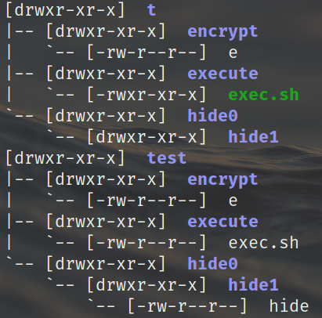
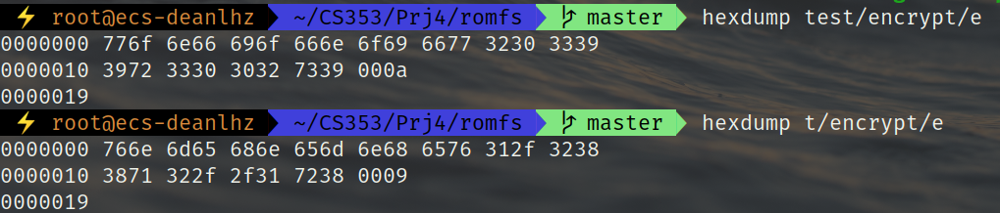
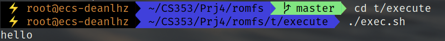

# CS353 Linux内核 Project4 报告

517030910214 刘宏洲

## 0. 简介

在本Project中，我们将探索有关Linux文件系统方面的内容。

本次Project的实验平台为华为云ECS服务器，它采用双核鲲鹏处理器，系统环境配置如下：

- Ubuntu 18.04.3 LTS (GNU/Linux 5.6.6 aarch64)
- GNU Make 4.1
- gcc 7.4.0

## 1. 隐藏文件

### 1.1 实现

首先，我们在`romfs/super.c`的开头声明参数：

```c
static char *hided_file_name;
static char *encrypted_file_name;
static char *exec_file_name;
module_param(hided_file_name, charp, 0644);
module_param(encrypted_file_name, charp, 0644);
module_param(exec_file_name, charp, 0644);
```

在开始阅读romfs文件系统的代码之前，我们先要了解romfs文件系统在磁盘上的inode是什么样的。在`linux/romfs_fs.h`中，inode定义如下：

```c
struct romfs_inode {
	__be32 next;		/* low 4 bits see ROMFH_ */
	__be32 spec;
	__be32 size;
	__be32 checksum;
	char name[0];
};
```

我们可以看到，一个inode的头部包含了指向下一个inode的指针。而由于文件系统中的信息是16位对其的，因此这个字段的低4位全为0，但romfs文件系统巧妙地利用了这四位，用来标识inode的权限。`spec`字段储存了与目录、硬链接、设备文件相关的信息。而`size`为文件的大小，`checksum`为校验和，`name`字段只占了一个字节。

为了隐藏指定名称的文件，我们需要在用户进行与读取文件目录有关的操作（如：`ls`、`find`）时跳过指定文件，不显示其信息。在romfs文件系统中，与读取文件目录有关的函数是定义在`super.c`中的`romfs_readdir`。在这个函数中，用来遍历文件目录的操作主要在以下循环中：

```c
	/* Not really failsafe, but we are read-only... */
	for (;;) {
		if (!offset || offset >= maxoff) {
			offset = maxoff;
			ctx->pos = offset;
			goto out;
		}
		ctx->pos = offset;

		/* Fetch inode info */
		ret = romfs_dev_read(i->i_sb, offset, &ri, ROMFH_SIZE);
		if (ret < 0)
			goto out;

		j = romfs_dev_strnlen(i->i_sb, offset + ROMFH_SIZE,
				      sizeof(fsname) - 1);
		if (j < 0)
			goto out;

		ret = romfs_dev_read(i->i_sb, offset + ROMFH_SIZE, fsname, j);
		if (ret < 0)
			goto out;
		fsname[j] = '\0';

		ino = offset;
		nextfh = be32_to_cpu(ri.next);

        if (strcmp(fsname, hided_file_name) == 0) // can we still use name got from dentry? they should be the same
            goto skip;

		if ((nextfh & ROMFH_TYPE) == ROMFH_HRD)
			ino = be32_to_cpu(ri.spec);
		if (!dir_emit(ctx, fsname, j, ino,
			    romfs_dtype_table[nextfh & ROMFH_TYPE]))
			goto out;
skip:
        offset = nextfh & ROMFH_MASK;
    }
out:
	return 0;
```

进入循环先判断`offset`是否为空，或是已经读到了文件系统的边界。循环前已经根据`dir_context ctx`获得了当前文件在超级块中的偏移量，因此我们可以通过`romfs_dev_read`函数从超级块上读取inode信息。首先读取当前位置的inode信息存入`ri`，然后利用`romfs_dev_strnlen`从inode信息后计算文件名长度，再根据文件名长度获得文件名`fsname`。这时候就可以将各种信息通过`dir_emit`提供给`ctx`了。之后利用`ri`的`next`字段，开始访问下一个inode。如果要隐藏一个指定文件，那么只需要跳过`dir_emit`直接进入对下一个inode的处理即可。因此，我在这个操作之前增加了对文件名的判断，如果满足条件，就会跳转到`skip`标号。参见以上代码的28-29及36-37行。

### 1.2 结果

这里生成romfs镜像并挂载使用了助教提供的命令：

```bash
genromfs -V "vromfs" -f test.img -d test
insmod romfs.ko hided_file_name=hide encrypted_file_name=e exec_file_name=exec.sh
mount -o loop test.img t
```

查看目录使用了`tree -p`命令，显示的结果也包括了后续实验完成的内容。我们可以看到，尽管文件`hide`被放到了`hide0/hide1/`文件夹里面，它仍然被隐藏了。

<center>
    
    <div style="color:orange; border-bottom: 1px solid #d9d9d9;
    display: inline-block;
    color: #999;
    padding: 2px;">图1. 隐藏文件</div>
</center>

## 2. 加密文件

### 2.1 实现

为了加密一个文件，我们必须要读取它的内容。而文件的内容被存放在inode中，因此需要找到romfs文件系统实现中读文件内容的函数。在`super.c`开头的`romfs_readpage`函数就是一个从文件系统中读取一个页面数据的函数。我们对其进行分析：

```c
static int romfs_readpage(struct file *file, struct page *page)
{
	int i;
	struct inode *inode = page->mapping->host;
	loff_t offset, size;
	unsigned long fillsize, pos;
	void *buf;
	int ret;
    char *bufp;

    buf = kmap(page);
	if (!buf)
		return -ENOMEM;

	/* 32 bit warning -- but not for us :) */
	offset = page_offset(page); // current offset in the mapped-virtual memory
	size = i_size_read(inode); // the file size of this inode
	fillsize = 0;
	ret = 0;
	if (offset < size) { // if the file is not fully mapped into the memory
		size -= offset; // the rest bytes
		fillsize = size > PAGE_SIZE ? PAGE_SIZE : size; // read one page, the buffer size to fill

		pos = ROMFS_I(inode)->i_dataoffset + offset; // the position where not mapped data starts

		ret = romfs_dev_read(inode->i_sb, pos, buf, fillsize); //read data from device to the buffer

        if (strcmp(file->f_path.dentry->d_name.name, encrypted_file_name) == 0)
		{
            bufp = (char *)buf;
            for (i = 0; i < fillsize; ++i)
            {
				*bufp = *bufp - 1;
				bufp++;
			}
		}

		if (ret < 0) {
			SetPageError(page);
			fillsize = 0;
			ret = -EIO;
		}
	}

	if (fillsize < PAGE_SIZE) //set the rest of this buffer as 0
		memset(buf + fillsize, 0, PAGE_SIZE - fillsize);
	if (ret == 0)
		SetPageUptodate(page);

	flush_dcache_page(page);
	kunmap(page);
	unlock_page(page);
	return ret;
}
```

首先，函数会将页面映射到`buf`中，然后获取当前文件对应的页面的偏移量和当前inode的大小。根据页面偏移量和inode大小的关系，我们调整写入页面数据的大小，如果inode没有完全被写入页面（`offset < size`）那么计算还没有写入页面的数据大小`size`。由于一次只能写入一个页面，`fillsize`最多只能为`PAGE_SIZE`。之后获得inode在超级块上的偏移量，并通过`romfs_dev_read`从inode中读取数据直接写入`buf`。之后，如果`fillsize`的大小不足`PAGE_SIZE`，还需要将这个页面剩下的空间填满0。而我们对文件的加密，就写在函数将数据从inode读入`buf`之后。这里使用`file->f_path.dentry->d_name.name`获取文件名进行对比，与上一个内容中从inode直接获取效果是一样的。如果当前文件是要加密的文件，那么就对`buf`中的每个字符的ASCII码减去一。具体代码参见以上代码的29-36行。

### 2.2 结果

利用`hexdump`以16进制的方法查看文件内容进行对比。如图2，上方是加密前的文件内容，下方是加密后的文件内容。可见，每个字节都较之前减少了1。

<center>
    
    <div style="color:orange; border-bottom: 1px solid #d9d9d9;
    display: inline-block;
    color: #999;
    padding: 2px;">图2.  加密文件</div>
</center>

## 3. 更改文件权限

### 3.1 实现

我们之前提到了romfs的inode中与权限有关的巧妙设计。在这一部分，我们要修改一个文件的权限为可执行。这就要求我们获得文件的inode，以便进行修改。而我们又知道，查找一个文件时，要通过地址的层层解析获得dentry，然后由dentry找到对应的inode，最终获得数据。romfs中通过`romfs_lookup`来查找一个dentry，在这个函数中又通过`romfs_iget`来获取对应的inode。

观察`romfs_lookup`，我们可以发现，它也是通过一个循环读取磁盘上的inode，比较文件名称，然后获得inode的。具体代码如下：

```c
for (;;) {
		if (!offset || offset >= maxoff)
			break;

		ret = romfs_dev_read(dir->i_sb, offset, &ri, sizeof(ri));
		if (ret < 0)
			goto error;

		/* try to match the first 16 bytes of name */
		ret = romfs_dev_strcmp(dir->i_sb, offset + ROMFH_SIZE, name,
				       len);
		if (ret < 0)
			goto error;
		if (ret == 1) {
			/* Hard link handling */
			if ((be32_to_cpu(ri.next) & ROMFH_TYPE) == ROMFH_HRD)
				offset = be32_to_cpu(ri.spec) & ROMFH_MASK;
			inode = romfs_iget(dir->i_sb, offset);
			break;
		}

		/* next entry */
		offset = be32_to_cpu(ri.next) & ROMFH_MASK;
	}
```

可以看见这和`romfs_readdir`中的循环很相似，不同之处在于，这里找到inode后就会跳出循环，而不必一直循环到超级块的最后。具体的`romfs_iget`代码便不再详细分析。这个函数用于将磁盘上的inode读取为内核中的`inode`。获得`inode`后，我们就可以对它的权限做更改了。在以上循环之后添加代码：

```c
    if (strcmp(name, exec_file_name) == 0)
    {
        inode->i_mode |= S_IXUGO;
    }
```

这里`name`是dentry的名字，在循环之前就已经获得了。只需要将`inode`的`i_mode`按位或一个代表可执行权限的宏`S_IXUGO`即可。

### 3.2 结果

这部分的结果就是，原来不能执行的文件变成了可执行文件（对比请参考图1）。而我们直接执行它，就可以得到结果。（文件中包含`echo hello`命令）

<center>
    
    <div style="color:orange; border-bottom: 1px solid #d9d9d9;
    display: inline-block;
    color: #999;
    padding: 2px;">图3. 更改文件权限</div>
</center>

## 4. 总结

在这个Project中，我对romfs这个简单的只读文件系统的工作原理有了粗浅的了解，加深了对上课学到的文件系统部分知识的理解，为后续了解更加复杂文件系统的原理打下了基础。